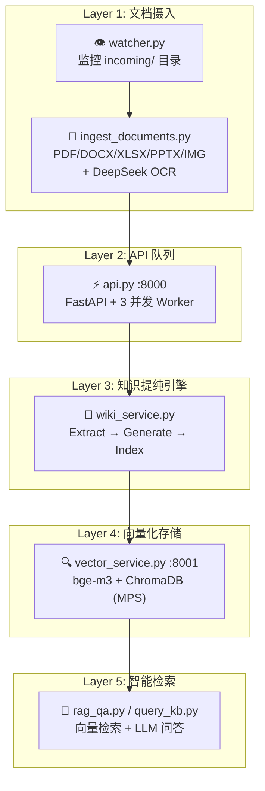

# WikiAgent 🧠

> **跨领域个人知识复利系统** — PDF 丢进去，Obsidian 知识图谱自动长出来。

[](https://python.org)
[](https://fastapi.tiangolo.com)
[](LICENSE.md)
[](https://obsidian.md)

WikiAgent 是一套**零成本、生产级**的个人知识自动化流水线。它把散落的 PDF、研报、论文自动转化为结构化的 Obsidian 知识图谱，并配备完整的向量检索与 RAG 问答能力。

```
PDF/DOCX/XLSX/PPTX ──► 多 Provider LLM 智能路由 ──► Obsidian 双链知识图谱 ──► bge-m3 向量检索 ──► RAG 问答
```

---

## ✨ 核心亮点

| 特性 | 说明 |
|---|---|
| 🚀 **零成本 LLM 路由** | 集成 12+ 免费 API Provider，智能降级，单文档处理成本 ≈ ¥0 |
| 📊 **图表 OCR** | PyMuPDF + DeepSeek 视觉模型，不只提取文字，连图表都能读懂 |
| 🔗 **Obsidian 原生兼容** | 自动生成实体卡片、概念卡片、来源页面，双链链接即开即用 |
| 🔍 **bge-m3 向量检索** | 中文语义检索 + 相似度评分，常驻 HTTP 服务消除每次 10-15s 加载 |
| 👁️ **目录自动监控** | `incoming/` 放入 PDF，watcher 每 15 分钟自动处理 |
| ⚡ **Circuit Breaker** | Provider 连续失败自动熔断，冷却结束后自动探测恢复 |
| 🛡️ **NVIDIA 配额监控** | 令牌桶限流 + 月度请求预算追踪，触顶前自动降级 |
| 🔄 **幂等向量同步** | 同一文档重复摄入不产生重复 chunk，确定性 ID 覆盖旧数据 |

---

## 🏗️ 系统架构



---

## 🚀 快速开始

### 1. 克隆与安装

```bash
git clone https://github.com/yourname/knowledge_base.git
cd knowledge_base

# 使用 uv 安装依赖（推荐）
uv sync

# 或使用 pip
pip install -r scripts/requirements.txt
```

### 2. 配置 API Key

```bash
cp .env.example .env
# 编辑 .env，填入你拥有的免费 Key（逗号分隔多个 Key）
```

支持 Provider 及获取方式：

| Provider | 免费额度 | 获取地址 |
|---|---|---|
| NVIDIA NIM | 1,000 req/month | [build.nvidia.com](https://build.nvidia.com) |
| Groq | 慷慨免费层 | [console.groq.com](https://console.groq.com) |
| ModelScope | 每日 2,000 次 | [modelscope.cn](https://modelscope.cn) |
| AIHubMix | 免费模型池 | [aihubmix.com](https://aihubmix.com) |
| OpenRouter | 每日免费限额 | [openrouter.ai](https://openrouter.ai) |
| ZhipuAI | 免费额度 | [open.bigmodel.cn](https://open.bigmodel.cn) |
| Tencent TokenHub | 100万 token 免费 | [tokenhub.tencentmaas.com](https://tokenhub.tencentmaas.com) |

> 💡 **不需要全部配置**，系统会自动检测可用的 Provider 并构建优先级链。

### 3. 一键启动

```bash
./start.sh
```

启动三个常驻服务：
- **Vector Service** `http://127.0.0.1:8001` — bge-m3 预加载，提供向量检索
- **Uvicorn API** `http://127.0.0.1:8000` — 3 Worker 并发处理摄入队列
- **Directory Watcher** — 每 15 分钟扫描 `incoming/`

### 4. 投递文档

```bash
# 方式 A：直接放入，watcher 自动处理
cp your-report.pdf incoming/

# 方式 B：手动立即触发
.venv/bin/python scripts/ingest_documents.py
```

### 5. 查看知识图谱

在 Obsidian 中打开 `wiki/` 文件夹，即可看到自动生成的实体、概念和双向链接。

---

## 🧭 Provider 智能路由策略

WikiAgent 将 LLM 调用拆分为 **Extract**（结构化提取）和 **Generate**（创意生成）两条独立链路，各有 6-11 个 Provider 自动降级。

### Extract 链（结构化任务）

```
NVIDIA-Qwen3 ──► NVIDIA-Mistral ──► NVIDIA-Minimax ──► NVIDIA-Llama ──► NVIDIA-Gemma
     │
     ▼
Groq ──► ModelScope ──► AIHubMix ──► OpenRouter ──► ZhipuAI ──► Tencent
```

- **NVIDIA 池**优先：5 个模型轮询，B200 原生推理，TTFT < 100ms
- **429 错误**：轮换 Key + 指数退避，不消耗通用重试次数
- **400/403 错误**：直接跳过当前 Provider，不再浪费时间重试
- **月度配额触顶**：自动降级到 Groq/ModelScope

### Generate 链（创意生成）

```
Tencent-TokenHub/hy3-preview ──► AIHubMix-Kimi ──► AIHubMix-MiniMax ──► AIHubMix-GLM5
     │
     ▼
OpenRouter ──► ZhipuAI ──► Tencent
```

- **TokenHub L1**：100万免费 token，负责高质量中文生成
- 全链熔断：连续 3 次失败进入 60s 冷却，冷却结束允许单次探测

---

## 📁 项目结构

```
knowledge_base/
├── 📄 api.py                    # FastAPI 后端 + 并发 Worker 队列
├── ⚙️  config.py                 # Pydantic Settings 配置中心
├── 🧠 wiki_service.py           # 核心知识提纯引擎（Extract/Generate 双链）
├── 📦 scripts/
│   ├── 📄 ingest_documents.py   # PDF/DOCX 摄入 + AI 元数据提取 + 重命名
│   ├── 🔍 query_kb.py           # 纯向量检索 CLI
│   ├── 💬 rag_qa.py             # RAG 问答终端（ModelScope + OpenRouter 池）
│   ├── 🗂️  sync_vector_db.py      # 向量库幂等同步 + 统一检索接口
│   ├── 📡 vector_service.py     # 常驻 HTTP 向量检索服务 (:8001)
│   ├── 👁️ watcher.py             # 目录监控，自动调用 ingest_documents
│   └── 🔄 retry_raw_ingest.py   # 重试 raw/ 目录历史记录
├── 📁 wiki/                     # Obsidian 知识库（实体/概念/来源）
├── 📁 incoming/                 # 文档投递口
├── 📁 archive/                  # 处理完成的 PDF 归档
├── 📁 chroma_db/                # ChromaDB 向量存储
├── 📁 docs/                     # 设计文档（API 策略、路线图）
├── 📄 INDEX.md                  # 知识库索引（AI 自动生成的报告摘要）
└── 📄 start.sh                  # 一键启动 / 停止 / 状态 / 日志
```

---

## 🛠️ 技术栈

| 层级 | 技术 |
|---|---|
| **API 框架** | FastAPI, Uvicorn, Pydantic |
| **LLM 调用** | OpenAI SDK, 12+ Provider 适配 |
| **文档解析** | PyMuPDF, python-docx, python-pptx, pandas, openpyxl |
| **图表 OCR** | DeepSeek 视觉模型 |
| **向量检索** | BAAI/bge-m3, ChromaDB, LangChain |
| **知识图谱** | Obsidian Markdown + 双链语法 |
| **配置管理** | Pydantic Settings, python-dotenv |
| **任务队列** | asyncio.Queue + 并发 Worker |

---

## 📖 使用场景

### 场景 1：研报归档
> 每天收到 5-10 份券商研报，丢进 `incoming/`，系统自动提取核心论点、支持证据、投资建议，生成带评分的知识卡片。

### 场景 2：论文阅读
> 读完一篇论文后把 PDF 放入，系统自动提取创新点、方法、实验结果，生成概念卡片和实体关联。

### 场景 3：团队知识库
> 多人共享一个 Git 仓库的 `wiki/` 目录，每个人都在 Obsidian 中查看和编辑同一份知识图谱。

---

## 🤝 贡献

欢迎 Issue 和 PR！如果你发现了新的免费 API Provider，或者想优化 Prompt 策略，随时提交。

---

## 📜 许可证

[MIT](LICENSE.md) © Haining Yu

---

> 🌟 **如果这个项目对你有帮助，请点个 Star**，让更多人看到零成本知识自动化的可能性。
### [9.5] [AI指数年度报告](archive/%5B%E4%BA%BA%E5%B7%A5%E6%99%BA%E8%83%BD_%E7%A7%91%E6%8A%80%E4%BA%A7%E4%B8%9A%5D_2026_%E6%96%AF%E5%9D%A6%E7%A6%8F%E5%A4%A7%E5%AD%A6%E4%BB%A5%E4%BA%BA%E4%B8%BA%E6%9C%AC%E4%BA%BA%E5%B7%A5%E6%99%BA%E8%83%BD%E7%A0%94%E7%A9%B6%E6%89%80%EF%BC%88HAI%EF%BC%89_AI%E6%8C%87%E6%95%B0%E5%B9%B4%E5%BA%A6%E6%8A%A5%E5%91%8A.pdf)

> **机构**: 斯坦福大学以人为本人工智能研究所（HAI） | **年份**: 2026 | **标签**: `人工智能` `科技产业` `AI治理`
>
> **评分理由**: _由斯坦福大学权威团队发布，数据来源覆盖Epoch AI、麦肯锡等头部机构，维度全面、数据详实，涵盖技术、产业、政策、社会影响全链条，洞见独到且具备全球参考价值。_

**【核心论点】**本报告核心观点认为，人工智能技术正处于加速普及与能力跃升阶段，但AI的发展速度已经远超治理框架、评估体系、教育配套、数据基础设施等周边系统的适配速度，形成显著的“发展-适配”鸿沟。当下AI已在多领域达到或超越人类基线能力，生成式AI的普及速度超过个人电脑和互联网，但技术能力、负责任AI建设、硬件供应链、人才流动、公众认知等维度均存在发展不均衡问题，全球各国AI政策走向分化，AI主权成为核心战略方向。

**【支持证据】**报告引用多维度权威数据支撑观点：技术层面，2025年行业产出了90%以上的知名前沿模型，SWE-bench Verified编码基准性能一年内从60%提升至接近人类基线100%，Gemini Deep Think获得国际数学奥林匹克金牌，但前沿模型读模拟时钟正确率仅50.1%；竞争格局上，2026年3月中美顶级模型性能差距仅2.7%，美国2025年知名模型59个、中国35个，中国领先论文量、专利量、工业机器人装机量，韩国人均AI专利全球第一；基础设施上，美国拥有5427个AI数据中心，全球90%以上领先AI芯片由台积电代工，2025年Grok 4训练碳排放达72816吨二氧化碳当量，AI数据中心总功率达29.6GW，相当于纽约州峰值用电需求；经济层面，2025年美国AI私人投资2859亿美元，是中国的23倍，生成式AI三年人口普及率达53%，美国消费者年价值达1720亿美元，客服和软件开发领域AI带来14%-26%的生产力提升，但22-25岁美国开发者2024年以来就业下降近20%；科研医疗上，AI已可替代部分科研流程，临床笔记生成工具让医生笔记时间减少83%，但仅5%的临床AI研究使用真实临床数据；人才层面，2017年以来赴美AI研究者数量下降89%，去年一年下降80%，所有国家AI人才性别差距自2010年以来无实质改善。

**【结论与建议】**报告最终结论明确，AI的爆发式发展已不可逆，当前的核心矛盾是技术迭代速度与配套体系建设的脱节。建议各国政府加快适配性监管框架建设，平衡创新激励与风险管控，欧盟、美国、中国需提升全球监管信任度；企业需重视负责任AI建设，补齐安全基准短板，同时探索AI降本增效的落地路径，关注 entry-level 岗位的结构性调整；教育机构需加快AI课程与政策制定，当前仅6%的教师认为现有AI政策清晰，需填补教育滞后缺口；科研与医疗领域需加大真实场景验证投入，提升AI落地的严谨性；全球需关注AI硬件供应链的单点风险，推动算力基础设施多元化布局，同时应对AI扩张带来的环境压力。

---

### [8.5] [2026 Agentic Coding Trends Report](archive/%5B%E4%BA%BA%E5%B7%A5%E6%99%BA%E8%83%BD_%E8%BD%AF%E4%BB%B6%E5%BC%80%E5%8F%91%5D_2026_Anthropic_2026_Agentic_Coding_Trends_Report.pdf)

> **机构**: Anthropic | **年份**: 2026 | **标签**: `人工智能` `软件开发` `编程代理`
>
> **评分理由**: _报告结构严谨、案例详实且数据具体，由Anthropic发布具有权威性，但作为趋势预测报告缺乏独立第三方验证数据，故评为优秀级别。_

**【核心论点】**本报告核心观点认为，2026年编程代理（Agentic Coding）将推动软件开发从传统的代码编写活动向代理编排活动转变。报告预测单一代理将演化为协调的代理团队，任务执行时间从数小时/天数缩短至分钟级，同时将代理编码能力扩展到非技术用户和跨职能部门。核心论点是：AI不是取代人类工程师，而是通过协作模式让人类专注于架构设计和战略决策，从实施者转变为编排者，从而实现软件开发生命周期的根本性重构。

**【支持证据】**报告提供了详实的数据和案例支撑：1）内部研究显示工程师60%的工作使用AI，但能完全委托的任务仅0-20%，证明协作而非替代的本质；2）Fountain采用分层多代理编排，实现筛选速度提升50%、入职速度提升40%、候选人转化率翻倍，某物流客户将新履约中心人员配置时间从1周+缩短至72小时内；3）Rakuten使用Claude Code在7小时内自主完成1250万行跨语言代码库的复杂任务，数值准确率达99.9%；4）TELUS团队创建超13,000个定制AI解决方案，工程代码发布速度提升30%，节省超50万小时，每次AI交互平均节省40分钟；5）CRED使用Claude Code将执行速度翻倍，同时维持金融服务的质量标准；6）Augment Code客户将原本预估4-8个月的项目在2周内完成；7）Zapier实现89%的全组织AI采用率，部署800+内部代理。

**【结论与建议】**报告最终结论明确指出：2026年成功的关键在于将代理编码视为战略优先事项而非增量生产力工具。对组织的四大行动建议：1）掌握多代理协调技术，处理单一代理无法解决的复杂性；2）通过AI自动化审查系统扩展人机监督，将人类注意力集中在最重要的事项上；3）将代理编码能力扩展到工程部门之外，赋能跨域专家；4）从最早阶段就将安全架构嵌入代理系统设计。报告强调，早期采用者和后期行动者之间的差距正在扩大，能够在不造成瓶颈的情况下扩展人类监督的组织，能够在保持质量的同时更快发展。

---

