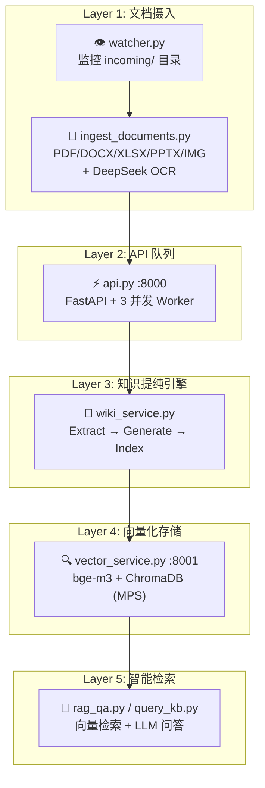

# WikiAgent 🧠

> **跨领域个人知识复利系统** — PDF 丢进去，Obsidian 知识图谱自动长出来。

[](https://python.org)
[](https://fastapi.tiangolo.com)
[](LICENSE.md)
[](https://obsidian.md)

WikiAgent 是一套**零成本、生产级**的个人知识自动化流水线。它把散落的 PDF、研报、论文自动转化为结构化的 Obsidian 知识图谱，并配备完整的向量检索与 RAG 问答能力。

```
PDF/DOCX/XLSX/PPTX ──► 多 Provider LLM 智能路由 ──► Obsidian 双链知识图谱 ──► bge-m3 向量检索 ──► RAG 问答
```

---

## ✨ 核心亮点

| 特性 | 说明 |
|---|---|
| 🚀 **零成本 LLM 路由** | 集成 12+ 免费 API Provider，智能降级，单文档处理成本 ≈ ¥0 |
| 📊 **图表 OCR** | PyMuPDF + DeepSeek 视觉模型，不只提取文字，连图表都能读懂 |
| 🔗 **Obsidian 原生兼容** | 自动生成实体卡片、概念卡片、来源页面，双链链接即开即用 |
| 🔍 **bge-m3 向量检索** | 中文语义检索 + 相似度评分，常驻 HTTP 服务消除每次 10-15s 加载 |
| 👁️ **目录自动监控** | `incoming/` 放入 PDF，watcher 每 15 分钟自动处理 |
| ⚡ **Circuit Breaker** | Provider 连续失败自动熔断，冷却结束后自动探测恢复 |
| 🛡️ **NVIDIA 配额监控** | 令牌桶限流 + 月度请求预算追踪，触顶前自动降级 |
| 🔄 **幂等向量同步** | 同一文档重复摄入不产生重复 chunk，确定性 ID 覆盖旧数据 |

---

## 🏗️ 系统架构



---

## 🚀 快速开始

### 1. 克隆与安装

```bash
git clone https://github.com/yourname/knowledge_base.git
cd knowledge_base

# 使用 uv 安装依赖（推荐）
uv sync

# 或使用 pip
pip install -r scripts/requirements.txt
```

### 2. 配置 API Key

```bash
cp .env.example .env
# 编辑 .env，填入你拥有的免费 Key（逗号分隔多个 Key）
```

支持 Provider 及获取方式：

| Provider | 免费额度 | 获取地址 |
|---|---|---|
| NVIDIA NIM | 1,000 req/month | [build.nvidia.com](https://build.nvidia.com) |
| Groq | 慷慨免费层 | [console.groq.com](https://console.groq.com) |
| ModelScope | 每日 2,000 次 | [modelscope.cn](https://modelscope.cn) |
| AIHubMix | 免费模型池 | [aihubmix.com](https://aihubmix.com) |
| OpenRouter | 每日免费限额 | [openrouter.ai](https://openrouter.ai) |
| ZhipuAI | 免费额度 | [open.bigmodel.cn](https://open.bigmodel.cn) |
| Tencent TokenHub | 100万 token 免费 | [tokenhub.tencentmaas.com](https://tokenhub.tencentmaas.com) |

> 💡 **不需要全部配置**，系统会自动检测可用的 Provider 并构建优先级链。

### 3. 一键启动

```bash
./start.sh
```

启动三个常驻服务：
- **Vector Service** `http://127.0.0.1:8001` — bge-m3 预加载，提供向量检索
- **Uvicorn API** `http://127.0.0.1:8000` — 3 Worker 并发处理摄入队列
- **Directory Watcher** — 每 15 分钟扫描 `incoming/`

### 4. 投递文档

```bash
# 方式 A：直接放入，watcher 自动处理
cp your-report.pdf incoming/

# 方式 B：手动立即触发
.venv/bin/python scripts/ingest_documents.py
```

### 5. 查看知识图谱

在 Obsidian 中打开 `wiki/` 文件夹，即可看到自动生成的实体、概念和双向链接。

---

## 🧭 Provider 智能路由策略

WikiAgent 将 LLM 调用拆分为 **Extract**（结构化提取）和 **Generate**（创意生成）两条独立链路，各有 6-11 个 Provider 自动降级。

### Extract 链（结构化任务）

```
NVIDIA-Qwen3 ──► NVIDIA-Mistral ──► NVIDIA-Minimax ──► NVIDIA-Llama ──► NVIDIA-Gemma
     │
     ▼
Groq ──► ModelScope ──► AIHubMix ──► OpenRouter ──► ZhipuAI ──► Tencent
```

- **NVIDIA 池**优先：5 个模型轮询，B200 原生推理，TTFT < 100ms
- **429 错误**：轮换 Key + 指数退避，不消耗通用重试次数
- **400/403 错误**：直接跳过当前 Provider，不再浪费时间重试
- **月度配额触顶**：自动降级到 Groq/ModelScope

### Generate 链（创意生成）

```
Tencent-TokenHub/hy3-preview ──► AIHubMix-Kimi ──► AIHubMix-MiniMax ──► AIHubMix-GLM5
     │
     ▼
OpenRouter ──► ZhipuAI ──► Tencent
```

- **TokenHub L1**：100万免费 token，负责高质量中文生成
- 全链熔断：连续 3 次失败进入 60s 冷却，冷却结束允许单次探测

---

## 📁 项目结构

```
knowledge_base/
├── 📄 api.py                    # FastAPI 后端 + 并发 Worker 队列
├── ⚙️  config.py                 # Pydantic Settings 配置中心
├── 🧠 wiki_service.py           # 核心知识提纯引擎（Extract/Generate 双链）
├── 📦 scripts/
│   ├── 📄 ingest_documents.py   # PDF/DOCX 摄入 + AI 元数据提取 + 重命名
│   ├── 🔍 query_kb.py           # 纯向量检索 CLI
│   ├── 💬 rag_qa.py             # RAG 问答终端（ModelScope + OpenRouter 池）
│   ├── 🗂️  sync_vector_db.py      # 向量库幂等同步 + 统一检索接口
│   ├── 📡 vector_service.py     # 常驻 HTTP 向量检索服务 (:8001)
│   ├── 👁️ watcher.py             # 目录监控，自动调用 ingest_documents
│   └── 🔄 retry_raw_ingest.py   # 重试 raw/ 目录历史记录
├── 📁 wiki/                     # Obsidian 知识库（实体/概念/来源）
├── 📁 incoming/                 # 文档投递口
├── 📁 archive/                  # 处理完成的 PDF 归档
├── 📁 chroma_db/                # ChromaDB 向量存储
├── 📁 docs/                     # 设计文档（API 策略、路线图）
├── 📄 INDEX.md                  # 知识库索引（AI 自动生成的报告摘要）
└── 📄 start.sh                  # 一键启动 / 停止 / 状态 / 日志
```

---

## 🛠️ 技术栈

| 层级 | 技术 |
|---|---|
| **API 框架** | FastAPI, Uvicorn, Pydantic |
| **LLM 调用** | OpenAI SDK, 12+ Provider 适配 |
| **文档解析** | PyMuPDF, python-docx, python-pptx, pandas, openpyxl |
| **图表 OCR** | DeepSeek 视觉模型 |
| **向量检索** | BAAI/bge-m3, ChromaDB, LangChain |
| **知识图谱** | Obsidian Markdown + 双链语法 |
| **配置管理** | Pydantic Settings, python-dotenv |
| **任务队列** | asyncio.Queue + 并发 Worker |

---

## 📖 使用场景

### 场景 1：研报归档
> 每天收到 5-10 份券商研报，丢进 `incoming/`，系统自动提取核心论点、支持证据、投资建议，生成带评分的知识卡片。

### 场景 2：论文阅读
> 读完一篇论文后把 PDF 放入，系统自动提取创新点、方法、实验结果，生成概念卡片和实体关联。

### 场景 3：团队知识库
> 多人共享一个 Git 仓库的 `wiki/` 目录，每个人都在 Obsidian 中查看和编辑同一份知识图谱。

---

## 🤝 贡献

欢迎 Issue 和 PR！如果你发现了新的免费 API Provider，或者想优化 Prompt 策略，随时提交。

---

## 📜 许可证

[MIT](LICENSE.md) © Haining Yu

---

> 🌟 **如果这个项目对你有帮助，请点个 Star**，让更多人看到零成本知识自动化的可能性。
