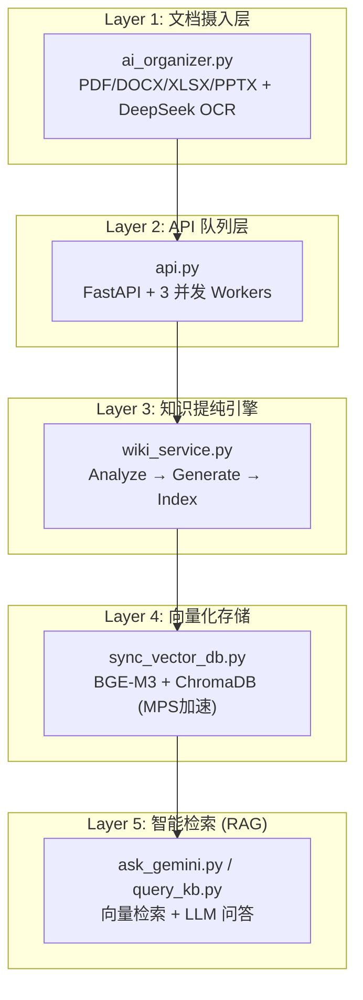
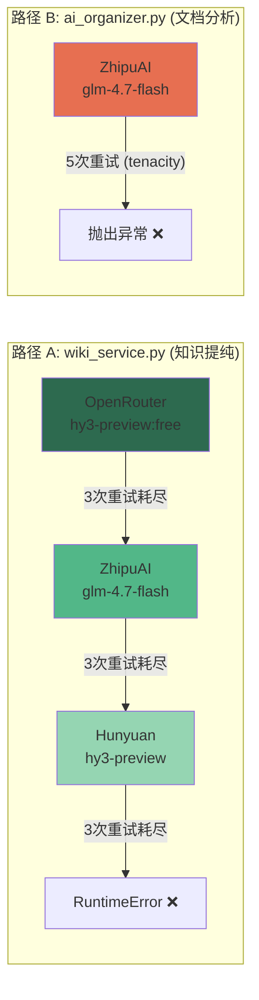

# WikiAgent 系统深度分析与发展路线图

## 一、当前系统能力概览



| 维度 | 当前状态 | 评级 |
|---|---|---|
| **多格式文档摄入** | PDF/DOCX/MD/XLSX/PPTX/IMG，含图表 OCR | ⭐⭐⭐⭐ |
| **LLM 分析提纯** | 两阶段 Analyze+Generate，Provider 三级降级 | ⭐⭐⭐⭐ |
| **知识图谱 (Obsidian)** | 双链自动化 + Index 归一化清洗 | ⭐⭐⭐⭐ |
| **向量检索 (RAG)** | BGE-M3 本地嵌入 + ChromaDB 幂等同步 | ⭐⭐⭐⭐ |
| **生产运维** | start.sh、3 并发 Worker、去重、日志 | ⭐⭐⭐⭐ |

---

## 二、已完成项目

### ✅ P0-1: 统一嵌入模型
`query_kb.py` 和 `ask_gemini.py` 从 `bge-small-zh` 统一为 `bge-m3`，修复检索结果失真的隐性 Bug。

### ✅ P0-2: 创建 `pyproject.toml`
锁定全部 22 个直接依赖，配置 `dependency-groups`。

### ✅ P0-3: 修复 ChromaDB 向量重复
引入确定性 ID + delete-before-insert 幂等模式，消除重复 chunk。

### ✅ P1-4: 并发 Worker + asyncio.Lock
3 个 Worker 并发处理 LLM 调用（纯 I/O 等待），文件写入由 `asyncio.Lock` 保护，吞吐量 ×3。

---

## 三、LLM Fallback 机制深度分析

### 3.1 当前架构

系统中有 **两套独立的 LLM 调用路径**，它们的 Fallback 逻辑完全不同：



### 3.2 路径 A 详解（`wiki_service._call_llm_core`）

**工作流程**：
1. 按优先级遍历 Provider 链：`OpenRouter → ZhipuAI → Hunyuan`
2. 对每个 Provider，最多重试 `max_retries=3` 次
3. 遇到 **429 Rate Limit** 时：轮换 Key + 指数退避 (`2s, 4s, 6s`)
4. 遇到**其他异常**时：轮换 Key + 固定 2s 等待
5. 当前 Provider 3 次全部失败后，降级到下一个 Provider
6. 所有 Provider 耗尽后，抛出 `RuntimeError`

**当前问题**：

| # | 问题 | 影响 |
|---|---|---|
| **F1** | **429 和非 429 错误混用同一重试计数器** | 一个 Provider 先遇到 1 次网络超时 + 1 次 429，第 3 次成功机会实际已被消耗。429 应该有独立的容忍度。 |
| **F2** | **`resp.raise_for_status()` 在非 200 时直接抛异常** | 400（请求体过大）、403（Key 失效）、500（服务端临时错误）被同等对待。400/403 完全不值得重试，应直接跳到下一个 Provider。 |
| **F3** | **无 Provider 健康感知** | 如果 OpenRouter 今天整体宕机，每次任务仍然会先尝试 OpenRouter 的 3 次重试（浪费 6-12 秒），然后才降级。没有"记住上次失败"的能力。 |
| **F4** | **路径 B (`ai_organizer.py`) 完全孤立** | 硬编码 ZhipuAI，无降级，与路径 A 的 Provider 链脱节。 |

### 3.3 优化建议

#### 优化 1: 区分可重试/不可重试错误

```python
# 不可重试的状态码 → 直接跳到下一个 Provider
NON_RETRYABLE = {400, 401, 403, 422}

if resp.status_code in NON_RETRYABLE:
    logger.warning(f"[{provider.name}] Non-retryable {resp.status_code}. Skipping to next provider.")
    break  # 跳出内层重试循环，直接进入下一个 Provider

if resp.status_code == 429:
    # 429 专用处理：轮换 Key + 退避，但不消耗通用重试次数
    ...
```

#### 优化 2: 临时降权（Circuit Breaker 熔断）

当一个 Provider 连续失败后，短时间内跳过它，避免每次任务都浪费时间：

```python
class ProviderConfig:
    def __init__(self, ...):
        ...
        self._fail_until: float = 0  # 失败冷却时间戳

    @property
    def is_available(self) -> bool:
        return time.monotonic() > self._fail_until

    def mark_failed(self, cooldown_seconds: float = 60):
        self._fail_until = time.monotonic() + cooldown_seconds
```

调用时：
```python
for provider in self.providers:
    if not provider.is_available:
        logger.info(f"[{provider.name}] Skipping (in cooldown)")
        continue
    ...
```

#### 优化 3: 成功后重置 Provider 优先级

当前如果 OpenRouter 降级到 ZhipuAI 成功了，下一次任务仍然会先试 OpenRouter（可能还在宕机）。熔断机制可以自动解决这个问题——冷却期过后自动恢复尝试。

#### 优化 4: `ai_organizer.py` 接入 Provider 链

将硬编码的 ZhipuAI 替换为复用 `_build_provider_chain()`，统一所有 LLM 调用的降级逻辑。这是路径 B 最大的单点故障。

### 3.4 优化优先级

| 优先级 | 优化 | 复杂度 | 收益 |
|---|---|---|---|
| **高** | F2: 区分可重试/不可重试错误 | 低 (10行) | 避免无意义重试浪费 6-12s |
| **高** | F4: ai_organizer 接入 Provider 链 | 中 | 消除路径 B 单点故障 |
| **中** | F3: Circuit Breaker 熔断 | 中 | Provider 宕机时吞吐量恢复 |
| **低** | F1: 429 独立重试计数 | 低 | 边际改善 |

---

## 四、后续发展建议

### P1 — 核心进化（待完成）

| # | 建议 | 状态 |
|---|---|---|
| ~~4~~ | ~~⚡ 并发 Worker + asyncio.Lock~~ | ✅ 已完成 |
| 5 | 📡 统一检索 API (`/api/v1/wiki/search`) | 待实施 |
| 6 | 📊 摄入状态 API + 仪表盘 | 待实施 |
| 7 | 🔄 ai_organizer 接入 Provider 链 | 待实施（= 优化 F4） |

### P2 — 远景进化

| # | 建议 | 预期收益 |
|---|---|---|
| 8 | 🧠 增量知识融合 (Diff 模式) | 避免内容漂移 |
| 9 | 🌐 incoming/ 自动 Watch | 消除手工运行 |
| 10 | 🔗 跨项目知识互联 | quant_lab/x_digest 自动推送 |
| 11 | 📱 Obsidian RAG 插件 | 写知识 → 用知识闭环 |
| 12 | 🧪 E2E 测试流水线 | 回归保护 |
